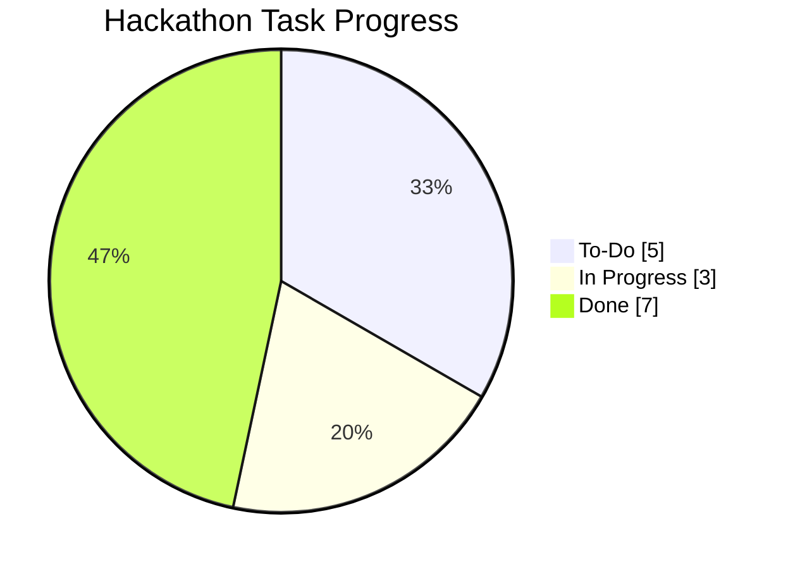

# 🌐 SynergySphere – Interactive React App 🚀

Welcome to **SynergySphere**, an intelligent and fun **team collaboration MVP** built with React, TailwindCSS, Framer Motion, and Recharts. This project was designed for hackathon demos and student projects — it’s **interactive, colorful, and engaging** for judges 🎉.

---

## 🔗 Live Demo
Try the live demo deployed on Netlify:

**Demo link:** https://synergysphere-app.netlify.app/auth

(Use the demo login / seed data to explore the app quickly.)

---

## ✨ Features

- 🔑 **Demo Login** (no backend required)
- 📂 **Project Dashboard** – manage multiple projects
- 📊 **Task Progress Visualization** with interactive Pie Charts
- 🗂️ **Kanban-style Board** – To-Do, In Progress, Done
- ➕ **Add & Track Tasks** with statuses
- 🎨 **Animations & Emojis** for an engaging experience

---

## 🖼️ Demo Screens

| Login | Dashboard | Charts + Tasks |
|-------|-----------|----------------|
| ✨ | 📂 | 📊 |


---

## 📊 Example Chart (Live in App)



---

## 🚀 Quick Start

Clone and run the React app locally:

```bash
git clone https://github.com/your-username/synergysphere.git
cd synergysphere

# Install dependencies
npm install

# Run locally
npm run dev
```

**Or try the hosted demo right now:** https://synergysphere-app.netlify.app/auth

---

## 🛠️ Tech Stack

- ⚛️ React (UI)
- 🎨 TailwindCSS (styling)
- 🎬 Framer Motion (animations)
- 📊 Recharts (charts/graphs)

---

## 📂 Project Structure

```
synergysphere/
├── src/
│   ├── App.jsx          # Main app (single-file demo)
│   ├── components/      # Extend here for modular code
│   └── index.js
├── package.json
└── README.md
```

---

## 🎨 Why Judges Will Love This

- ✅ **Instant demo** (no backend, works standalone)
- ✅ **Visually engaging** with emojis, animations & charts
- ✅ **Hackathon-ready** – quick to showcase
- ✅ **Interactive** – Kanban + chart updates live

---

## 🚧 Future Enhancements

- 🔥 Drag-and-drop Kanban
- 🔔 Real-time notifications
- 💬 Chat + comments
- 📆 Calendar integration
- 🤖 AI-powered task suggestions

---

## 👥 Credits

Built with ❤️ for **Hackathon 2025** by [Your Team Name].
